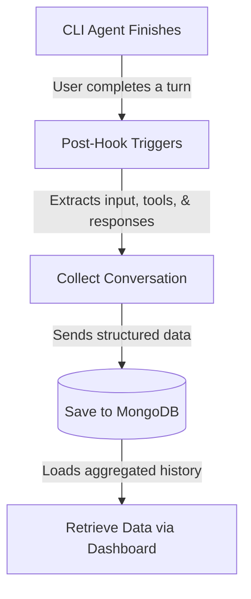

# Agent CLI Prompt Analysis Dashboard

A comprehensive dashboard to view and analyze your agentic conversation history. This application is designed to help "vibe coders" understand their interaction patterns with CLI agents and improve their prompting techniques.

## Features & Insights

### 1. In-Depth Prompt Analysis
Get deep insights from your chats to understand your prompting patterns, identify anomalies, and receive actionable suggestions on how you can improve your prompts. 

**Why is this important?** 
As AI agents become more autonomous, the quality of your prompt dictates the quality of the outcome. Many developers unknowingly fall into anti-patterns—such as being too vague, providing insufficient context, or constantly hitting token limits. By analyzing your history, you can uncover these hidden patterns, learn from past failures (like an agent getting stuck in a loop), and refine your communication. This not only saves API costs but drastically reduces debugging time and retry rates, making you a much more effective "vibe coder."

### 2. Flexible Insight Scopes
You can generate insights across all your historical prompts, filter them for a specific group of related prompts, or narrow down to a single session.

**Why is this helpful?** 
Different scopes solve different problems. Looking at *all* prompts gives you a macro-view of your overall habits and long-term improvements. Filtering by a *group of prompts* is perfect for understanding how you tackle a specific type of task (e.g., frontend debugging vs. database migrations) and what phrasing works best for each. Analyzing a *particular session* allows you to forensically examine a single complex interaction, helping you pinpoint exactly where an agent went off track and how your subsequent prompts either corrected or confused it.

## How the Workflow Works

The system seamlessly captures and serves your data in the background without interrupting your flow:

## Getting Started

To run the application locally, you will need to start both the backend server and the frontend development server.

1. **Backend**: Navigate to the `server` directory, install the Python dependencies, and run `app.py`. See the [Server README](./server/README.md) for detailed setup instructions and environment variable configurations.
2. **Frontend**: Navigate to the `cli-dashboard` directory, install the Node dependencies, and run the development server. See the [Frontend README](./cli-dashboard/README.md) for more details.
